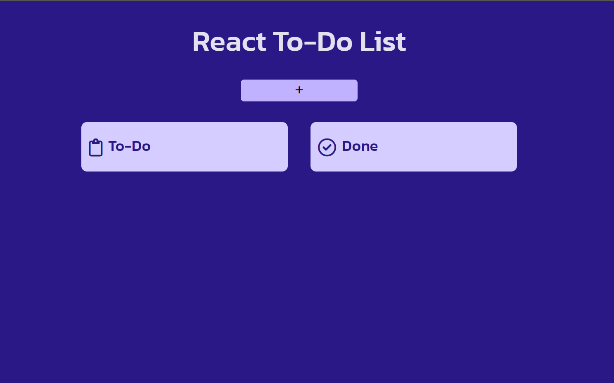
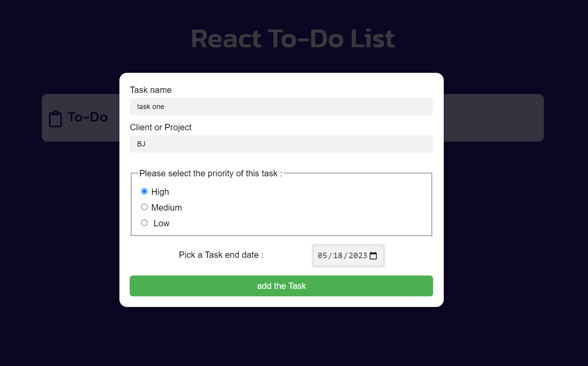
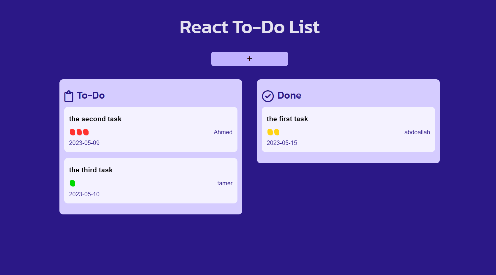

# To-DO List by React 

This is a simple Todo List application built using React. The purpose of this project is to demonstrate the basics of React and React hooks.

### Features
The Todo List application has the following features:

- Add a new todo item.
- Mark a todo item as complete
- Delete a todo item
- return the completed taskes
- restore taskes from localstorage

### Screenshot

### Links

- Solution URL: [Add solution URL here](https://github.com/Abdoallah-Badr/todo-list_react)
- Live Site URL: [Add live site URL here](https://todo-list-react-badr.vercel.app/)

## My process

### Built with

- ReactJs 
- javascript
- CSS custom properties

### What I learned

-  appling react key concepts, such as components and state management.
- learn about srtucturing react app.
- write clean, maintainable React code.

## Author
- linkedin - [@AbdoallahBadr](https://www.linkedin.com/in/abdoallah-badr-5b2bb1250/)